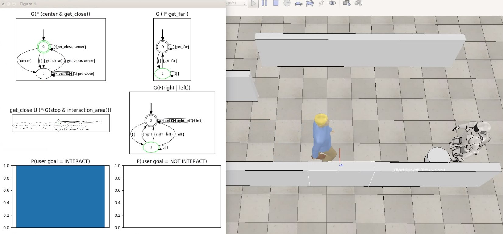

# Intent Recognition in HRI using LTL

A human walks in the scene. While he moves the robot compute probability that he want to interact with it, based on linear temporal logic and automata theory.

## Dependencies
- VREP
- flloat

## Running the code 
Open the scene with V-REP, then run Reasoning.py

 
